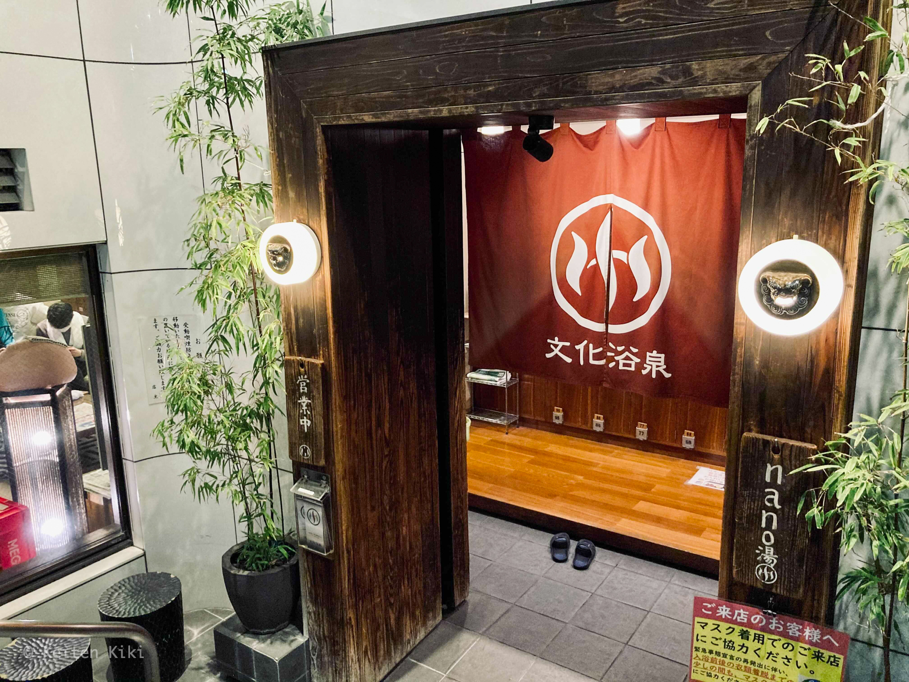

ここ最近は忙しく、長いこと銭湯に行くことができなかった。
調べてみると1月以来行ってないから約4ヶ月ぶりということになる。
そして、転職した関係で東京に引っ越したのだが、この2ヶ月はシャワーしか浴びておらず湯船に恋い焦がれる時間を過ごしていた。

だが、ちょっと仕事も慣れてきたし、ストレス発散の意味も込めて近場の銭湯へ行くことを決めた。
そこが今日紹介する文化浴泉である。Googleマップで調べると割と評価も高く、東京一のサウナだと評する人もいる。流石にそれがないだろうと思ったけど期待が高まるばかりだ。

この銭湯はよくある銭湯とは違い、非常に洗練された外観を持つ。

一見すると銭湯とは分からない感じだ。一応目立つ煙突があるから場所が分からなければそれを目印に進めば良い。

靴箱を見て嫌な予感がした。
ここまで板がない靴箱も珍しい。
田舎だとこういった板式の靴箱は板を紛失することが多いから少ない。
そもそも盗まれないから必要がない。
しかし、東京ではそうもいくまい。
この板は番台に預けてロッカーのキーと交換するので鞄へ仕舞ってはダメだ。

料金はこのようになっている。
調べると東京の銭湯は470円で統一してあるようだ。
九州の温泉に慣れている者としてはただの沸かし湯でこの値段は驚くだろうが、場所代もあるし仕方ないとも言える。

あと、特筆すべき点としてサウナはプラス料金ということだ。
これも元・九州の民としては驚かざるを得ない。
今までの人生でサウナは当然ながら入浴料に含まれているものと思い込んでいた。
しかし、東京生まれ東京育ちの同僚に聞くと私の考えの方が異端らしい。
これから東京で生きていくうえで、不本意ながら常識を上書きするときが来たのだろう。

それで、もちろんプラス料金でサウナへ入ることにしたが、予想外にもバスタオルを貸してもらえた。
実はバスタオルは持参したのでこの分は安くしてもらいたいところだがありがたく受け取った。

靴箱の時に嫌な予感がしていたが、浴室は今までに経験したことがないほどの人で溢れかえっていた。
これが東京の銭湯かと洗礼を受けた。
しかし、せっかく来たのだから楽しむより他はない。
サウナ室の前では2,3人が並んでいたのでその後ろに並ぶ。
それにしても、サウナへ入るのに並ばなきゃならない日が来るとは。

10分ほど並んでようやくサウナに入ることができた。
定員6人のこじんまりとしたサウナ。
ふわっと鼻に香るアロマの匂い。
これが本当に良い香りである。
何を使ってるのかとても気になる。
サウナ室内の温度を105℃前後を保たれている。
なかなかの高温である。

また九州の話で申し訳ないが、地方のサウナだと100℃を超えていることはまずないと思ってもらって良い。
それは高齢者が多く、彼らが高い温度に耐えられないからだ。
彼らは本当のサウナの楽しみ方を分かってはいない。
その点、若人が多い東京のサウナの素晴らしさ。
周りを見てもタトゥーが入ったり髪をピンクに染めたりしている連中もいて文化の幅を感じる。
おじいちゃんの肩身が非常に狭そうであった。
比率で言うと9:1で若者が多い。
サウナってこんなに人気があったっけ。

そして、サウナ後の水風呂だが、キンキンに冷えていて昇天するかと思った。
バイブラも装備されているし、最高の水風呂だ。
水温は15℃くらいだったと記憶している。
それだけ低ければ十分だ。
残念ながら、水風呂の後にはプラスティック製の椅子に座って瞑想するのが「ととのう」ためには必須なのだがその椅子が2つしかない。
仕方なく湯船の縁に腰掛けて目を瞑る。
こんな悪条件にも関わらず、周りの音が一切聞こえなくなるほどととのうことができた。

それから2セットをこなし、全てにおいてハイパフォーマンスを発揮できたのは細かいところまで配慮されたサウナの環境に他ならない。
以下がそのポイント。

* サウナ内のアロマ
* 座席をヒーターの近さ
* 狭いサウナ設計
* バイブラ付きのキンキンに冷えた水風呂
* 文化的な開放感
* もちろん、サウナマットは置いてある
* 100℃を超える室温
* テレビなし
* 薄暗い証明

意外にもこれらの条件を全て満たしたサウナは圧倒的に少ない。
どれが欠けてもダメだし、1つでも際立つ欠点があれば全て台無しだ。
客層も関係あるがそこは運である。
今回は特に問題なかった。
偏見だが若者の方がそこはしっかりしている気がする。

サウナも素晴らしいが、銭湯としてのクオリティは担保されている。
赤富士の絵も綺麗だったし、謎のnano湯と呼ばれるきめ細かい泡湯を楽しむこともできる。
2時間ほどの滞在だったが日頃の疲れを十分に癒すことができた。
不満点としては人の出入りが激しいために床がたいへん汚い。
スリッパを持っていけば良かった。

[[i | 公式サイト]]
| <https://www.bunkayokusen1010.com>

***

<iframe src="https://www.google.com/maps/embed?pb=!1m14!1m8!1m3!1d6484.217515708542!2d139.687306!3d35.649692!3m2!1i1024!2i768!4f13.1!3m3!1m2!1s0x0%3A0x2dc60dfc93b2fd97!2z5paH5YyW5rW05rOJ!5e0!3m2!1sja!2sjp!4v1633090399397!5m2!1sja!2sjp" width="700" height="300" style="border:0;" allowfullscreen="" loading="lazy"></iframe>
