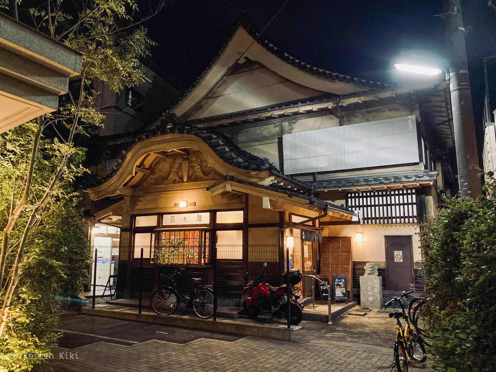
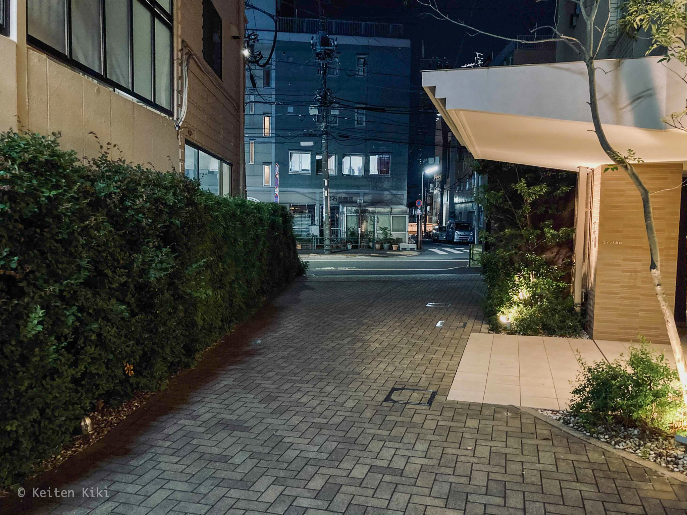
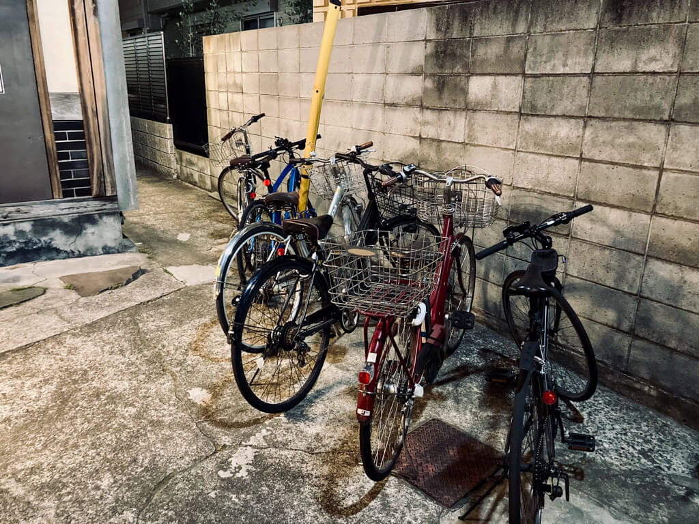
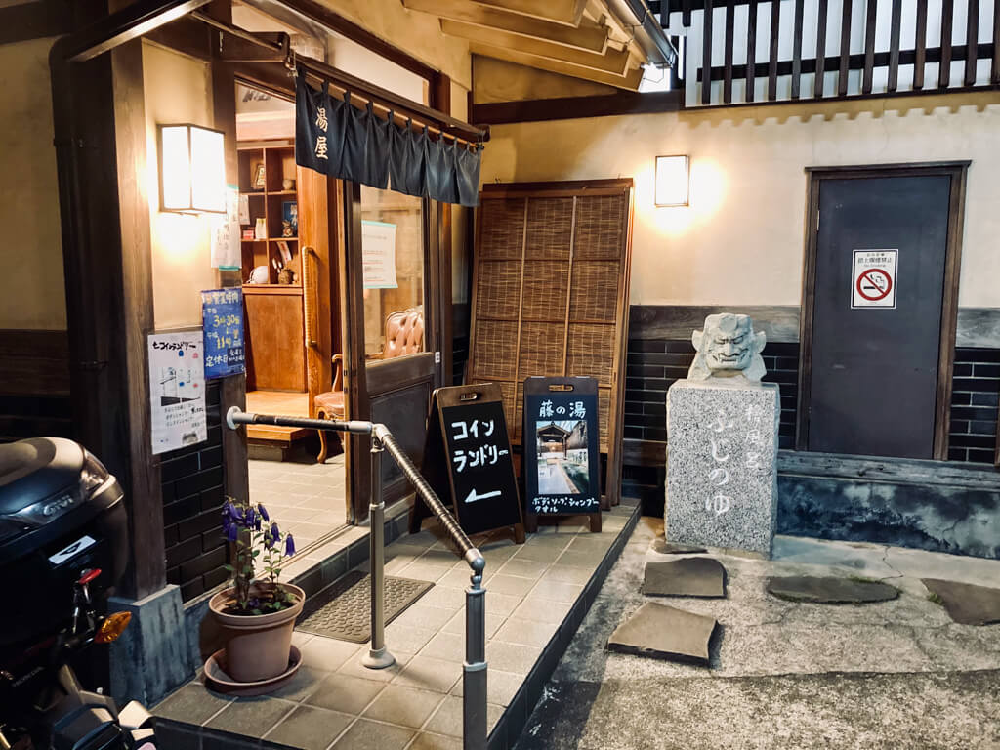
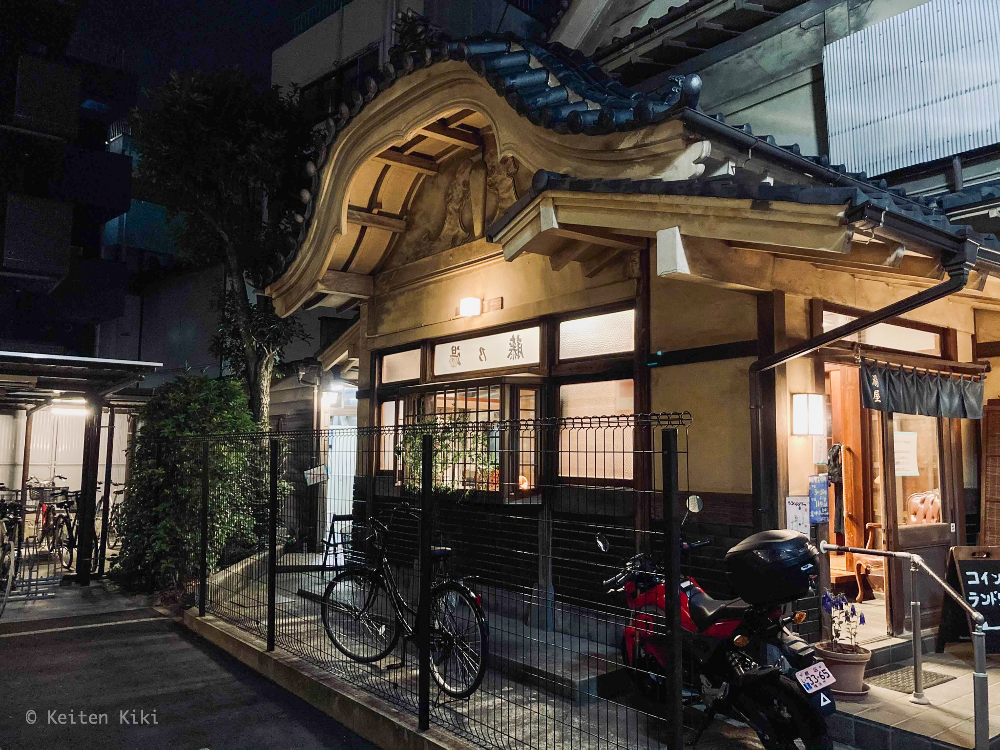

以前は銭湯なんてただの沸かし湯で行く価値はないかな、なんて思っていた時もあったが、一人暮らしをすると毎日湯船に浸かる機会は激減する。
それ故に泉質がどうとか言う前に広々とした開放的な空間への羨望が日に日に高まってくる。

今回訪問したのは世田谷の玉川台にある藤の湯という銭湯である。
自転車にスマホを取り付け、Googleマップを眺めながら向かった。
夜9時頃に出発したのだが、あの辺は駅が近いので帰宅途中の人間がとても多い。

面構えはこんな感じ。
こんなところに銭湯があるの？って場所にあるのも趣深い。
元はこの銭湯がこの地域のランドマークだったが、マンションやら住宅街やらが開発されていくことで奥へと追いやられたように見える（目の前にマンションがある）。

自転車が無造作に並べてあったのでそこにお邪魔した。
丁度いいところに電柱の支線があったからそこに鍵を括り付けた。
やっぱり地球ロックしないと盗難怖い。

入り口はこんな感じ。
鬼の像が厳つい。
コインランドリも併設されているみたい。
東京の銭湯ってコインランドリ併設が多い気がする。
確かに、入浴する前に洗濯機回せば上がる時には終わっているから時間効率は良い。

ここから先は写真撮れなかった……。
というのも予想通り人が多かったからね。
東京で浴室を撮るのは無理そうである。
とはいえ、他の人が撮った写真やホームページの紹介もあるしリスクを冒してまで撮る必要はない。

入り口から入るといきなり番台があっておばちゃんたちが元気にお話ししていた。
久々にアウェー感を感じた。

それで靴箱は良くある板が鍵になってるパターンのやつ。
更衣室は結構広々としていて開放感はあるね。
東京の銭湯の良い点としてロッカーの鍵がデフォルトで付いていることが挙げられる。
これは前にも書いたかもしれないけど、地方の温泉だと100円が返ってこないロッカーもあるから非常に有難い。
たまにロッカーすらないところもあるぐらいだから安心を100円で買えるのなら安いかもしれないが。

浴室に入って驚かされたのは天井の高さだ。
そんなに面積は大きくないのだけれど天井が高いだけで圧迫感がなくなる。
まずは身体を洗うがシャワーは固定式。
そしてカランがお湯と水のセットであるから、それを自分でブレンドする方式だね。
お湯が激アツであることはなく、ブレンドせずとも使えるのは良かった。
桶はケロリン。

身体も綺麗にしたことだし、ようやくお湯に浸かれる。
この銭湯の差別化ポイントとしての檜風呂から先に入ってみた。
ただ、誰も入りたがっていないことから想像ついたが、とにかく温い。
それもそのはずでお湯が注がれておらず溜めてあるだけだ。
せっかくの檜が勿体無いな。
その檜風呂の他にはバイブラ＆ジェットバスの浴槽があるのみ。
横幅は4m程あり、ここがメインだろう。
お湯の温度は42℃くらいかな、丁度良かった。

とまあ、ざっと書いたがこんな感じだ。
客層は満遍なく分布していておじいちゃんから若者まで幅広い。
普通に刺青が入ったヒッピー風の男性も居た。
最近は家に引き篭もってばかりだったから自分が社会の一員であるということをまざまざと感じさせられた。
それが公衆浴場の良さでもある。
それぞれの人生が存在して、偶然にも銭湯で、裸で巡りあうというのは面白い。

現在は緊急事態宣言の影響で22:00までしか営業していないが、次来る時は締め出される寸前の時間を見計らって行こうと思う。

[[i | せたがや銭湯ガイド]]
| https://www.setagaya1010.tokyo/guide/fuji-no-yu/

***

<iframe src="https://www.google.com/maps/embed?pb=!1m14!1m8!1m3!1d51891.76178805932!2d139.630945!3d35.62193!3m2!1i1024!2i768!4f13.1!3m3!1m2!1s0x0%3A0xc1cdca749857b841!2z6Jek44Gu5rmv!5e0!3m2!1sja!2sjp!4v1633239209367!5m2!1sja!2sjp" width="700" height="300" style="border:0;" allowfullscreen="" loading="lazy"></iframe>
