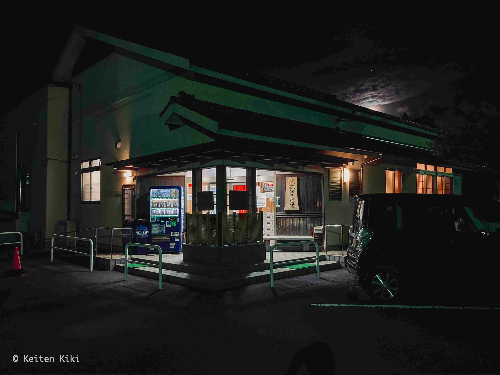

<!-- @format -->

鹿児島県薩摩川内市にある [隈之城温泉](https://kumanojou-spa.com) を訪問した。
国道 3 号線沿いにあるが入り口が非常に分かりづらいので慎重に運転しないといけない。
特に夜は真っ暗になるからね。

日帰り入浴の料金は 370 円と鹿児島では平均的（それでも十分安いが）。
営業時間は 6:00 ~ 22:50 まで。鹿児島の温泉の特徴として朝の開店が早い。
夏ならまだしも冬の朝イチから熱い湯に入って血圧とか大丈夫なのか。

泉質はナトリウム - 塩化物泉の源泉掛け流しである。薩摩川内の温泉は硫黄泉が多いと思っていたから（川内高城温泉など）、塩化物泉はちょっと意外だったな。
塩分は保温効果が高いので汗が止まらなくなる。夏向けの泉質ではない。

特筆すべき点としてメタ珪酸の値が 118.1mg/kg と高く、美肌効果を期待できる。
一応、サウナもあるけど 4 人でいっぱいになる程度の大きさなので時間帯によっては入れないかもしれない。

訪問したのが夜だったのでほぼ貸切で温泉を堪能できた。
地方の温泉は家風呂代わりにしている人が多いためかゴールデンタイム（17:00 ~ 19:00）は混むことが多い。
だからあえて時間をずらして旅のスケジューリングをするのが鉄則である。

民宿もやっているみたいだから旅の中継地点としては良い選択肢かもしれないね。
周りに何もないけど。
