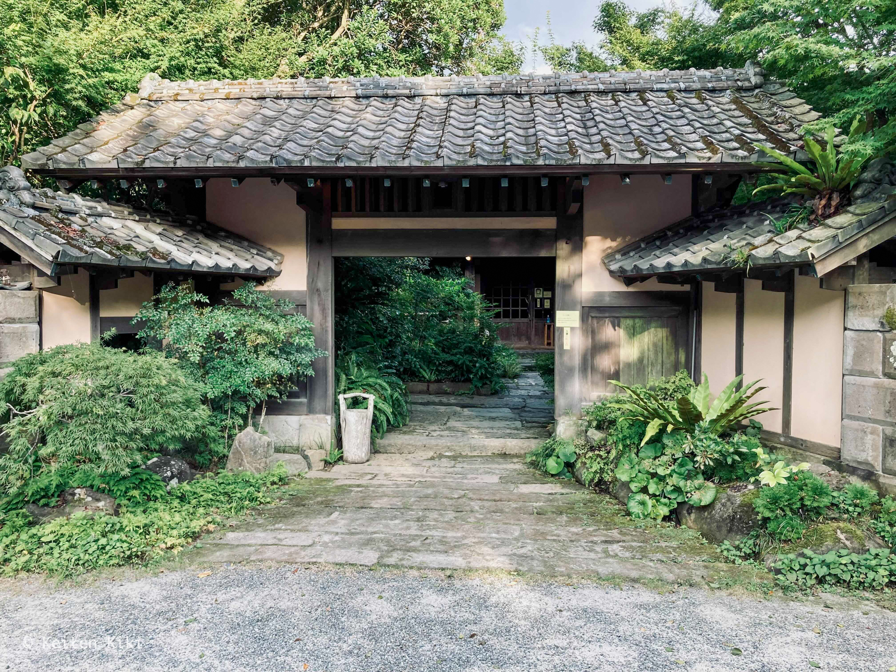

<!-- @format -->

鹿児島県日置市にある [つれづれの湯](https://www.city.hioki.kagoshima.jp/kanko/kankou/tomaru-onsen/onsen/yukaidaonsen.html) を訪問した。
ゆかいだ温泉という名称は知らなかった。近くに有名な湯之元温泉があるのでその一部と考えても問題ないだろう。

場所だが、温泉名が異なるだけあって湯之元温泉街から少し離れたところにある。
そして、この道が広くないため離合に気をつけなければならない。
ずっと道形に進んでいくと目印となる看板がある。多分、なければ通り過ぎてしまうだろうね。

なかなか立派な門である。
この周辺の温泉は昔ながらの公衆浴場といった箇所が多く、言い方は悪いがボロくさい建物ばかりなのでちょっと感動した（あえてボロいところに行くのだけれど）。

入浴料は 500 円。日帰り入浴にしては少し高めの料金設定だ。
ただ、この料金設定が 100 円違うだけで客層がガラッと変わるのは面白い。
湯之元温泉は 120 ~ 150 円あれば入浴できるから 500 円の温泉に地元民は普通来ない。
そして、どの温泉地でも共通する点として地元民ほど民度が低い（自分の家だと思っているのかな）。
気持ちよく温泉に浸かりたいのであれば周辺の温泉を比較して料金が高い場所を選ぶべきである。

こちらが脱衣所。
清潔感があり、木材も丁寧に処理されていて素晴らしい。
着替えを入れるケースがゴム製だったのには驚いた。
なんて言ったらいいのか、この温泉は全体的に見て良い意味で感性が若い。
鹿児島の片田舎でこのような体験をするとは思ってもみなかった。
そういえば、受付のお兄さんも長髪でお洒落な感じだったなあ。
体感だけど温泉だけに限らず、飲食店とかも何でこんなところにこんな施設があるんだろうといった場所が増えている気がする。

泉質は硫黄泉でもちろん源泉掛け流しである。
大量に浴槽から溢れ出ているのを見ると嬉しくなっちゃうね。
そして、お湯はエメラルドグリーンに輝いており、鮮度の良さを伺える。

源泉の泉温は 88.2℃ とのことだが、ちょうど良い温度（41℃ ほど）に調整されていた。
どのように泉温を下げているのかが気になるところだ。
ちなみに近くの湯之元温泉では尋常でない熱さ（44℃ ~）がデフォルトなので少し心配していた。あれは異常だわ。

嬉しいことにサウナもある。
だが、一般的なドライサウナとは異なり、蒸気で発汗を促すタイプである。
おそらく源泉温度が高いからそれを利用しているのだろう。
温泉成分を蒸気として直接身体に取り込めるので温泉の効能に肖りたいのであれば入るしかない。
しかし、実際に入ってみると息をするのも苦しいぐらいの熱さだった。
ちょっとでも動くと火傷しそうになるからじっと目を瞑ってひたすら耐える。

隣接された水風呂は残念ながらぬるめの水温。
近くにはベンチもあって、外気浴を楽しめるサウナーにとっては理想的な環境が揃っている。

ただし、今はどうか分からないけどスズメバチがブンブン飛んでいたから気になってととのえなかった…。

入浴後は休憩スペースでのんびりした。
真夏にわざわざ温泉で汗を流してぼーっと涼みながら休憩するなんて最高過ぎるでしょう。
しかも、キンキンに冷えた水とコーヒーも飲み放題でホスピタリティに溢れている。
何も言うことはないね。

改めて思ったが、鹿児島の温泉ポテンシャルはすごい。
今後はいつ行けるか分からないけど、また行ってみたいと思える温泉だった。
