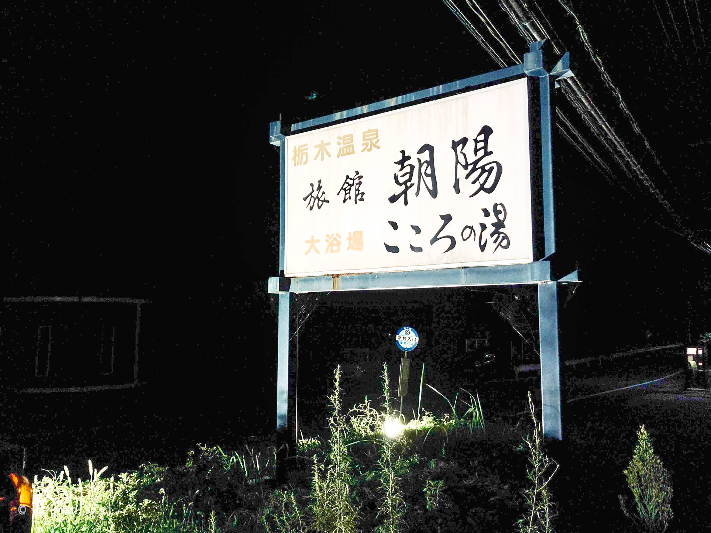
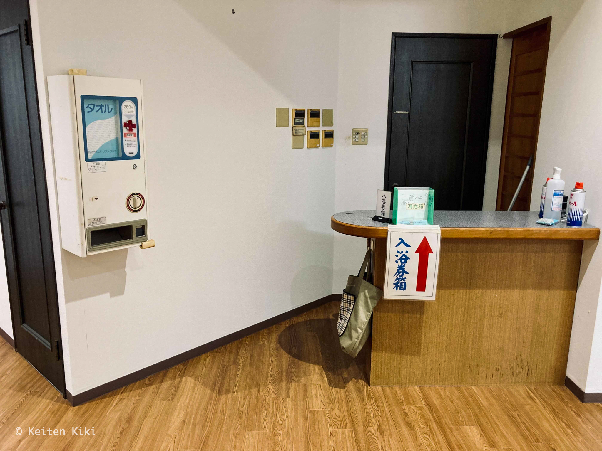
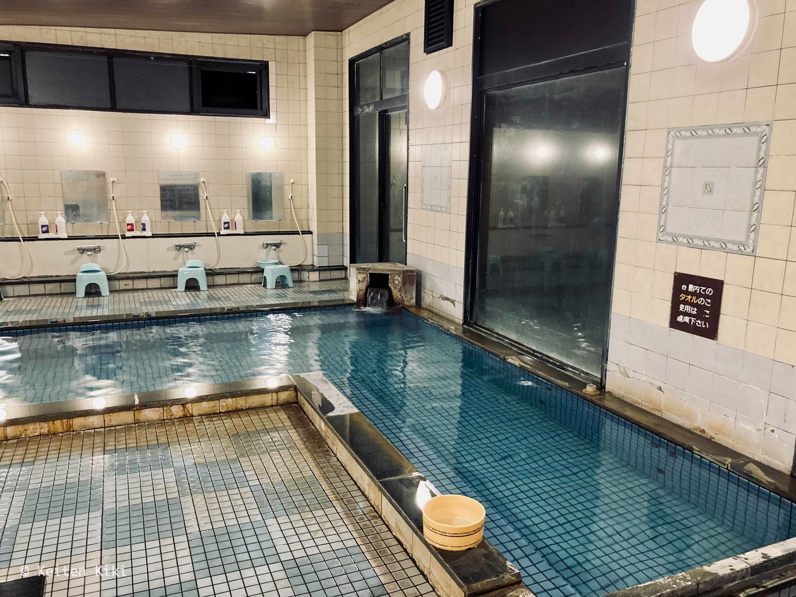
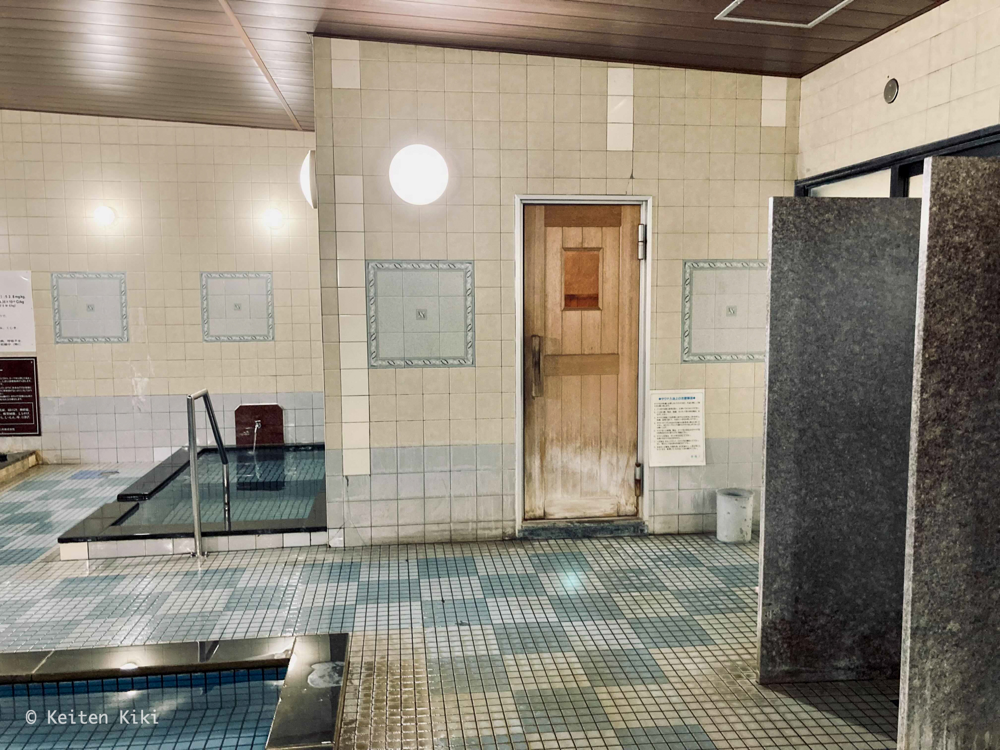

<!-- @format -->

熊本県南阿蘇村の栃木（とちのき）温泉旅館朝陽を訪問した。
南阿蘇村というと 2016 年の熊本地震で大きな被害を受けたことで有名である。

この温泉のすぐ近くには崩落した阿蘇大橋があり、到着するまでに地震の破壊的な爪痕を垣間見た。
地震が起きてからはしばらく営業していなかったようだが、今年になって営業再開したということなので訪れてみた訳である。

閉館間際の温泉の雰囲気が好きなのであえてギリギリの時間を選ぶが、周辺の道が暗すぎてとても分かりにくかった。
幽霊が出そうな場所にある。

しかも、受付には誰もおらず客が 1 人も居ない。旅館でこんなことがあって良いのか？
人の気配が全くなくて下手なホラー映画より怖かった。

入浴券を入れる箱があることからシステムを把握できたが、肝心の券売機が周囲にない。
箱の中に数枚の券が入っていたけど、一体どこで手に入れたのだろう。仕方ないから現金をそのまま投入した。

貸切の温泉は最高だ。
泉質は中性に近いアルカリ性単純泉で、まさに普通といったところかな。
成分分析表を見ると、加水はしていないが加温はしているらしい。
残念ながら薬湯と露天風呂はお湯を溜めておらず温泉は大きい浴槽 1 つしかない。
それだけ来客が少ないのだろう。

予想外に良かったのが、このサウナである。
貸切なのもそうだが、サウナストーンが置いてあったのでお湯をじゃんじゃん掛けてサウナ室を超高温にした。
水風呂も冷たくてメリハリがある。
ここは温泉ではなくサウナ目的で行くのが良さそう。

結局、最後まで誰とも会うことはなかった。
というか、営業していたのかな。
今考えても謎で不気味だわ。
