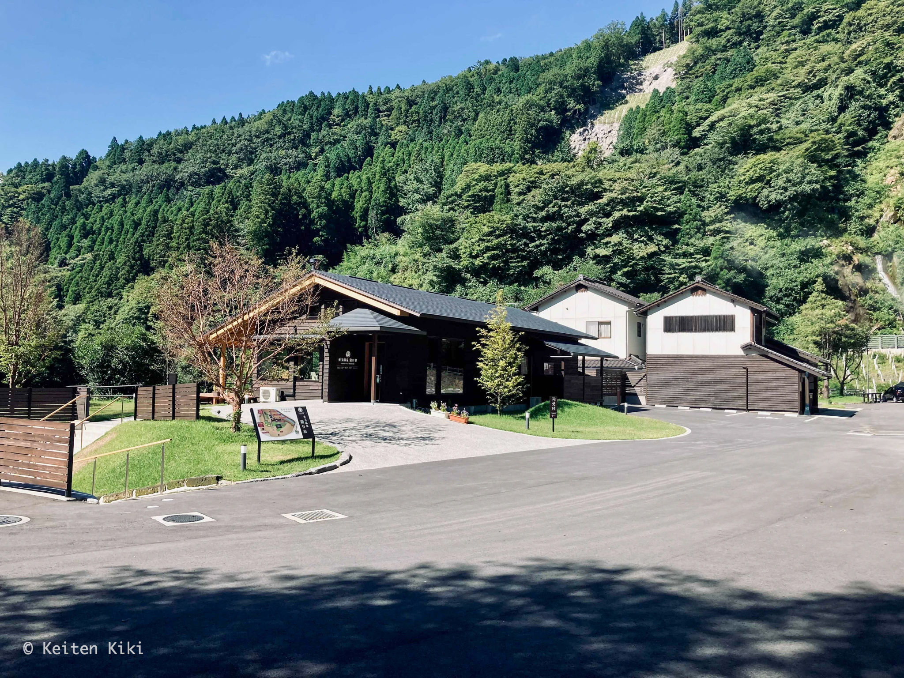
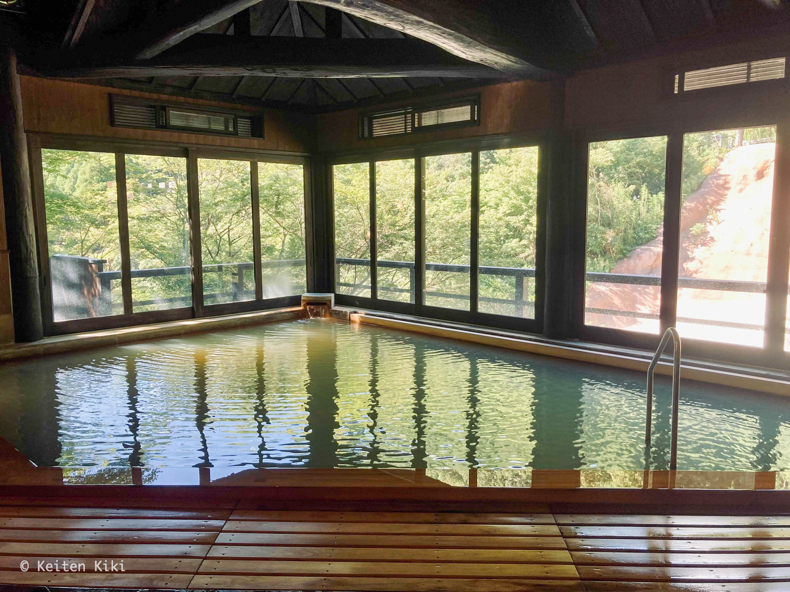
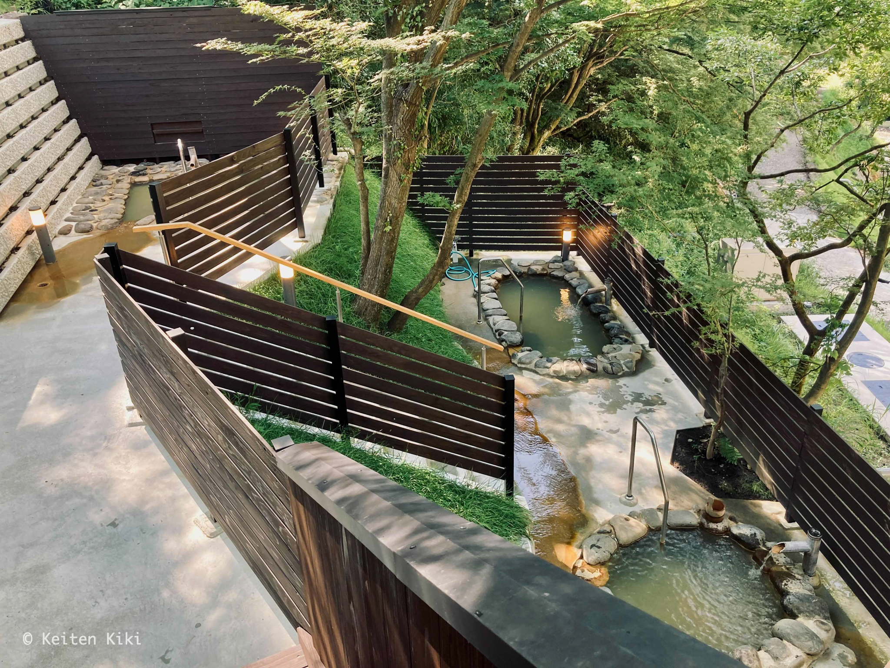

<!-- @format -->

2016 年の熊本地震以来、長らく休業していた [垂玉温泉](https://tarutama.jp) がリニューアルオープンしたということなので行ってみた。
以前は山口旅館という名称だったがリニューアルの際に瀧日和と名称が変わったそうだ。
日帰り入浴のみ受け付けている。

ここに辿り着くまではひたすら細い道を登り続けなければならない。
まさに秘湯といった場所に位置する。
施設自体は新築されているため鄙びた感じはしないが、創業は江戸時代末期と歴史がある温泉地である。
与謝野鉄幹、北原白秋らの書いた五足の靴という紀行文にも登場する（読んだことはないが）。
下記に引用してみた。

> 「後に滝の音面白き山を負い、右に切つ立ての岡を控へ左の谷川を流し、前はからりと明るく群山を見下し、遙に有明の海が水平線に光る。
> 高く堅固な石垣の具合､黒く厳しい山門の様子、古めいた家の作り､辺りの要害といひ如何見ても城廓である、天が下を震はせた昔の豪族の本陣らしい所に､一味の優しさを加へた趣がある。
> これが垂玉の湯である､名もいゝが、実に大に気に入つた」

確かに垂玉って名前は響きが良いよな。
それ以外はちょっと何を言っているか分からないが。

こちらが大浴場。
建物の設計が素晴らしく、差し込んだ光が泉質の良さを際立たせている。
温泉分析表の写真を撮り忘れたの正確な値は分からないけど、単純硫化水素泉ということで満足感は高い。
これだけ浴槽が大きくてもザバザバと掛け流しているから相当湧出量が多いのだろう。

そして、露天風呂はバラエティに富んでいて面白い。
3 つあるのだけど、それぞれ微妙に深さや大きさ、泉温が異なる。
空を見ながら浸かれる寝湯が気に入った。

この温泉は万人にオススメできる。
ただ、辺鄙な場所にあるから気軽には行けないのが難点だよな。
すぐ近くには名湯・地獄温泉もあるからついでに寄るのも良いかも。
その際は水着をお忘れなく（混浴のため）。
