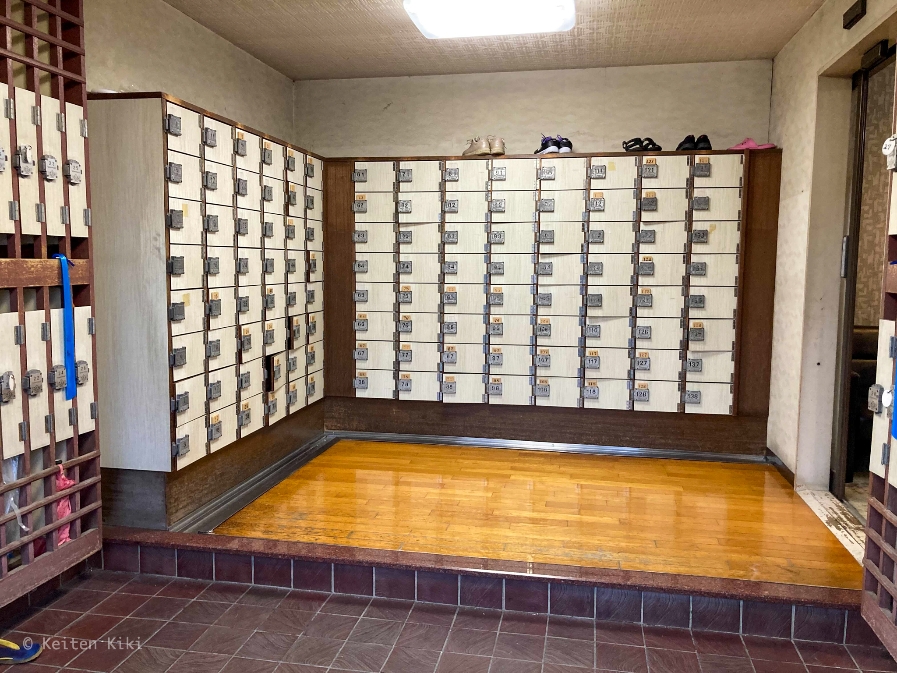

暑さも落ち着いて、ようやく銭湯の季節がやってきた。行き帰りで汗をかくのは辛いからここ最近は行くのを控えていた。
仕事をさっさと終わらせてから久しぶりに銭湯へと向かった。

今日は東急田園都市線の用賀駅から徒歩5分のところにある銭湯「栄湯」を訪問した。
外観はご覧の通りで、開店（16時）から20分過ぎにも関わらず多くの自転車が止められていた。

宮造り建築を改装した外観ということで周辺の建物と比べてみても目立つ。
入口にある「看板には皆様に愛される公衆浴場」とあるが、立シャワーとフロント型式という今では全然珍しくないものを宣伝していることからも歴史ある銭湯であることが読み取れる。

靴箱は鍵が板になっているタイプ。今回は木製ではなくプラスチックだったが。
東京の銭湯は板タイプがデフォルトなのかな。傘を入れるスペースも鍵付きというのは珍しい。

こちらがロビー。かなり年季の入ったアイテムが並ぶ。特にエアコンは凄い。

入浴料は東京の銭湯であるから480円。サウナは別料金で300円を追加で支払う。今回は入浴のみにしてみた。
番台では後期高齢者と見られるおじいちゃんが居て、「タオルやシャンプーはないよ」と声を掛けてもらったが私みたいな若い人が来るのは珍しいのかなと察した。

こちらがロッカーである。鍵は無料で掛けることができるので一安心だ。
そして、さっきの推測が正しいことを浴室に入って実感することになる。

7、8人が浴室内に居たが全員が老人で、私だけが若いという正に日本の現代から未来を象徴するような縮図が展開されていた。

まずは身体から洗うことにしたが、湯屋カランから出てくるお湯が茶色い。なんなんだろうか。サビかな。こういった形でワビサビを感じたくはなかった。

浴槽は3つに別れている。

* 左：薬湯（成分は分からなかったが白かった）
* 中：超音波ジェット
* 右：バイブラ

バリエーションに富んでいるが、温度がかなり高めに設定されているため悠長に楽しむ余裕はなかった。
壊れている可能性はあるが、温度計は45℃を指していて驚いた。
冬に来れば良さそうかな……。

泉質は言うまでもないが、肌がキュッとする銭湯特有の塩素臭を伴ったものであった。しかし、銭湯に泉質の良さは1ミリも求めていないから問題なし。

さすがに熱すぎたのでさっさと上がった。ロッカーの横にはレストスペースがある。
火照った身体を鎮めるためにゆっくりしつつ、巨人の連敗が止まらないことを愚痴る老人の話に耳を傾ける。やっぱり巨人ファンが多いのだろうか。

それにしても、銭湯と高齢者の依存関係は興味深い。今日は特にそれを感じた。
歳を取るごとに時間を持て余すことも多いだろうから銭湯や温泉に行きたくなるものなのかな。
最近では若い人もサウナにハマっている人が多いけれど、銭湯もいいぞということは伝えていきたいな。

[[i | せたがや銭湯ガイド]]
| <https://www.setagaya1010.tokyo/guide/youga_sakae-yu>

***

<iframe src="https://www.google.com/maps/embed?pb=!1m18!1m12!1m3!1d2537.0677220739635!2d139.63433173832664!3d35.62774354260184!2m3!1f0!2f0!3f0!3m2!1i1024!2i768!4f13.1!3m3!1m2!1s0x6018f4741039a113%3A0x8b547a3b99d40910!2z5qCE5rmv!5e0!3m2!1sja!2sjp!4v1634386077961!5m2!1sja!2sjp" width="700" height="300" style="border:0;" allowfullscreen="" loading="lazy"></iframe>
