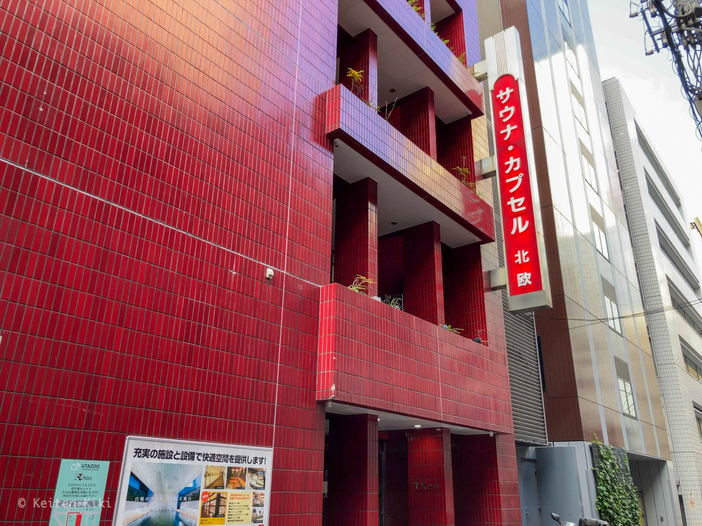
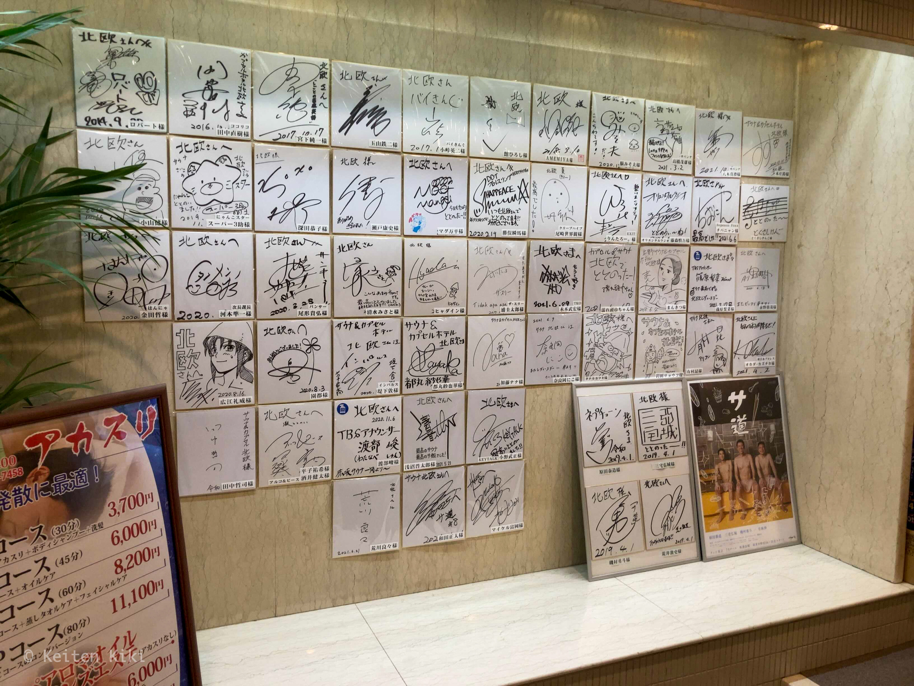
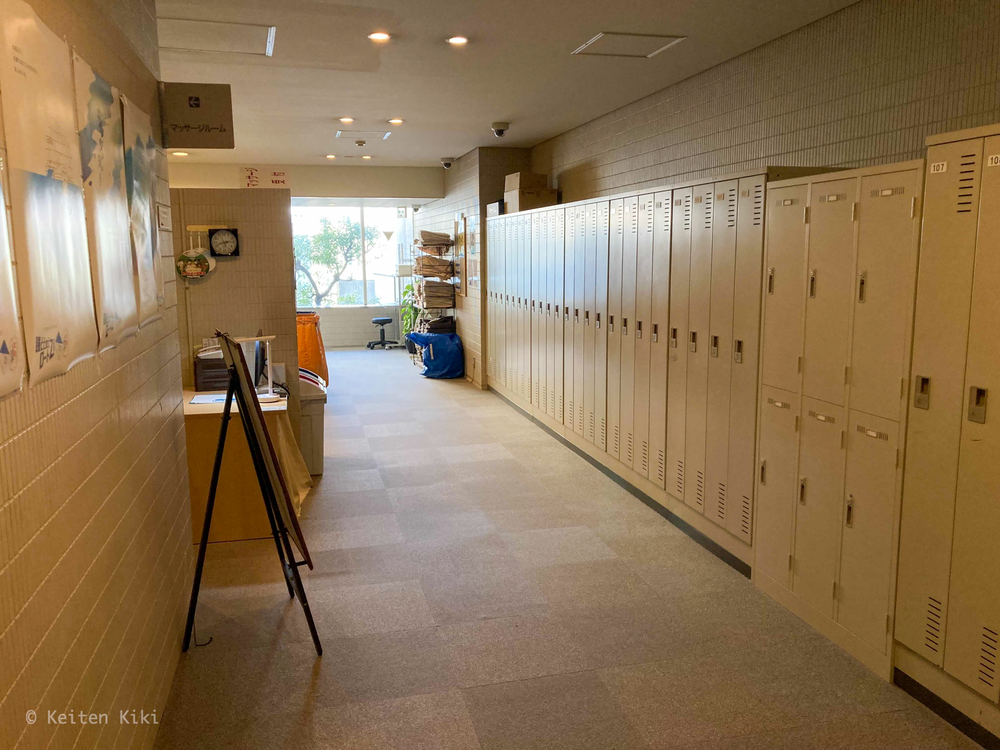
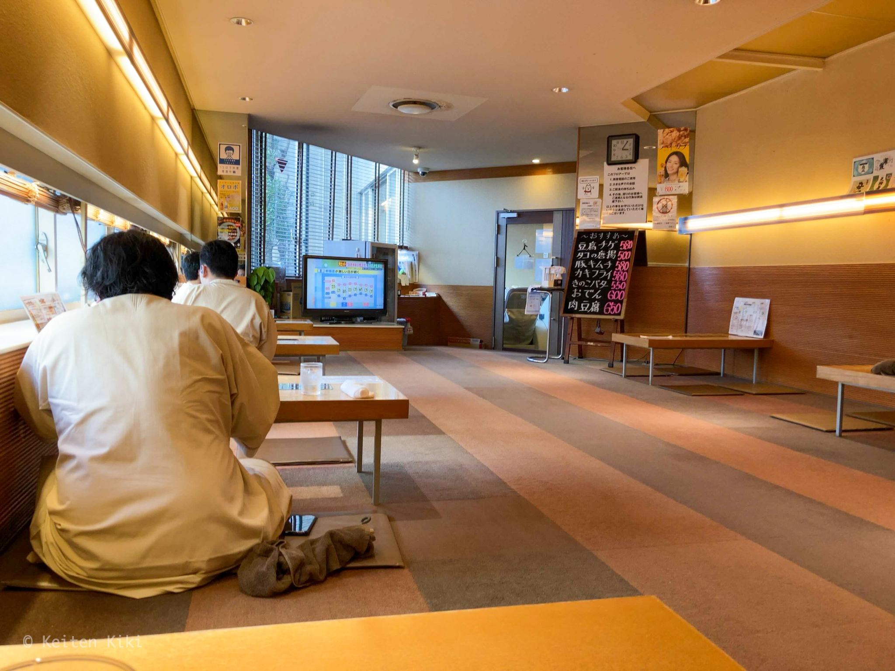
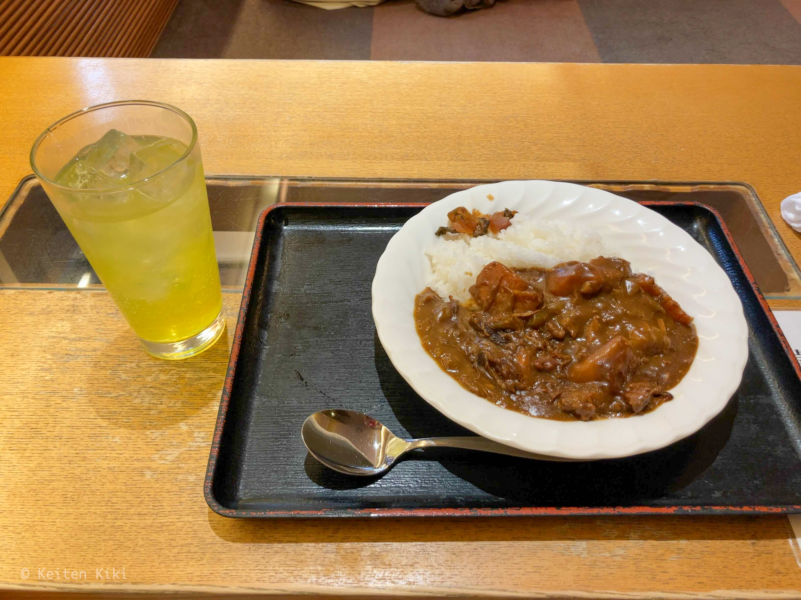
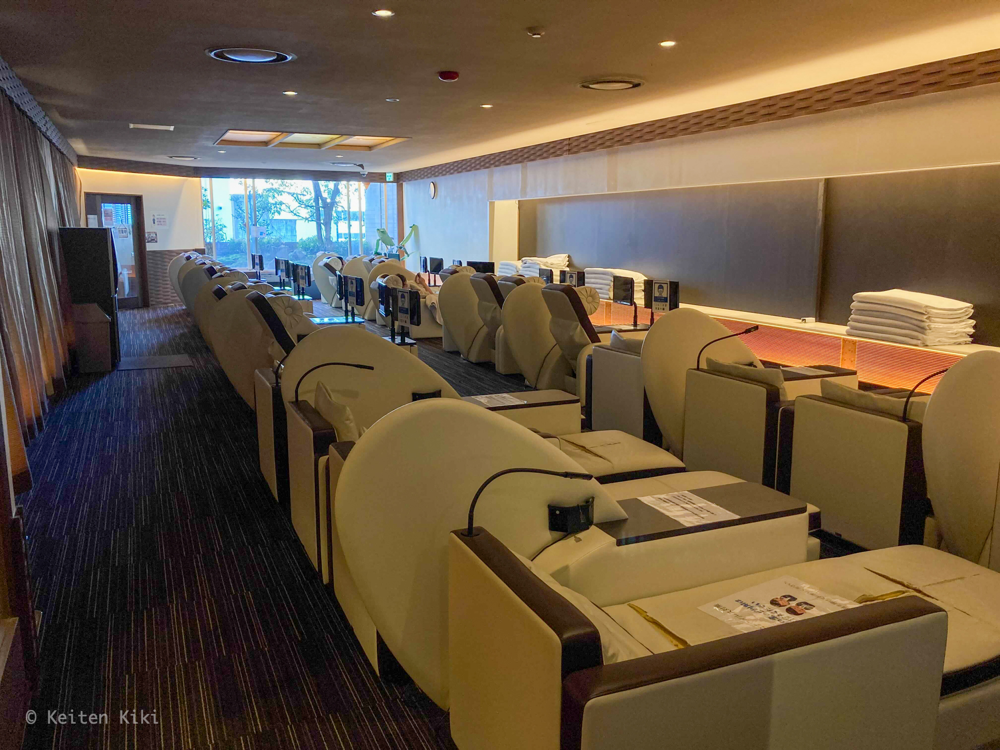

今日は以前から行ってみたかったサウナ北欧を訪問した。

このサウナは「[サ道](https://www.tv-tokyo.co.jp/sa_una37/)」というドラマに登場していたことで有名である。
第1話の舞台にもなったし、ほぼ毎回主人公たちが集うサウナでもあるので、ある意味ドラマをもっとも象徴するサウナだ。
ミーハー的な考えだがやっぱりサウナを愛する者として一度は行きたいと思っており、ようやく行くことができた。

なお、現在はコロナ対策として予約制を取っている。
むしろ、その方が人数も少なく快適なのでできれば続けてほしいが。

今回の予約はWebサイトで行った。2日前から予約可能であるが人気なのですぐに枠が埋まってしまう（特に土日）。
どうしても今日でなければ嫌だったので23:59には待機して日付が変わったら即予約した。
もちろん、開館直後の枠を予約。サウナは3時間プランがデフォルトだから1時間毎に10人程度増えていく計算になるため、可能であれば人数の少ない開館直後がオススメである。

立地は上野駅から徒歩1分と抜群のロケーションだ。
真っ赤な外観は駅を出たらすぐに分かるレベル。
入口が通りに面したほうではなく反対側にあるので注意しないといけない（ちょっと迷った）。

受付は6階にあるのでエレベーターで向かう。
扉が開くと有名人のサインがズラリ。
何とも言えない独特な香りがする。

料金はちょっとお高めの2,000円。
ただ、休憩室も使える点を考慮すれば妥当な金額かな。それにタオルやシャンプーなども付いているからね。手ぶらで来られる。
支払いは電子マネーも使える。このタイミングでロッカーの鍵を受け取る。

ロッカー周辺は人も少なく広々と使うことができて良かった。
棚に館内着やタオルなど置いてあるので各自で取るスタイルである。
館内を移動する際は専用のガウンとパンツを着用しなければならない。

サウナは上の7階にある。貴重品を入れるためのロッカーはない点に注意。
さて、ようやくここからサウナのレビューをしていこう。

まずはサウナへ入る前に身体を清める。
垢擦りも無料で使えるのでありがたい。

このままサウナに直行しようと思ったけど、少し出遅れたためサウナ上段は埋まっていた。
そのため、ひとまず露天風呂で時間を潰すことにした。

この露天風呂だが**トゴールの湯**と呼ばれ、新潟県の栃尾又温泉近くから産出される風化鉱物（[トゴール・ウォームタイト](http://www.togoal.co.jp/togoal/whats_togoal.html)/医薬部外品45D283号）を使用している。
確かに、そこら辺にある銭湯の泉質ではないことが明らかに分かる。ちょっとトロミがあり、肌に気泡が付着する温めの不思議なお湯だった。

ちらほら外気浴をする人も出てきたので念願のサウナに向かった。
思惑通りサウナの上段をゲット。一度この流れを手にしたらインターバルを保つことで良い席に座り続けられる。
温度計を見ると110℃近くを指しており、なかなかの熱さである。

室内にはテレビが1台あるが音量も絞られており、個人的にはそこまで気にならなかった。
一応、セルフロウリュも可能である。
サウナ上級者と見られるサウナハットを被ったおじさんが「掛けても良い？」と聞いた数秒後に水が弾ける心地よい音とアロマの香りが室内に広がる。
この時点で後悔したのだが、頭に被せるタオル（サウナハット）は必須だ。熱さで耳がもげるかと思った。

何とか目標の10分を耐え切り（サウナタイマーが壊れていたのでテレビで時間を確認）、15℃に保たれた水風呂へと浸かる。
これが温過ぎず冷た過ぎずでちょうど良い加減だった。この季節なので1分で切り上げて外気浴へと向かう。

外には椅子が10脚ほど、デッキチェアは3脚（人気で常に埋まっていた）置いてある。
この空間がとにかく最高だった。
東京のビル街のど真ん中で空が開けた景色を見ながら、秋の風に吹かれ無の境地へと至る。
見事にととのうことができた。

その後も上記のルーティーンをこなし、計3セット（10分x3）で終えることにした。
この時点で14:30。14時組も入ってきて騒がしくなってきた。
あんまりのんびりしているとご飯を食べて休憩する時間もなくなってしまう。
小腹も空いてきたことだし、館内にあるレストランへ向かった。

お支払いはロッカーの鍵が付いたブレスレット内に埋め込まれたチップを読み取る方式。
一番人気の北欧カレーとオロポ（オロナミンC + ポカリ）を注文した。
私がレストランに来たときは人が居なかったのだが、続々と増えてきた。
みんな示し合わせたかのようにカレーとオロポを注文するので笑ってしまった。

こちらが注文の品。
カレーは実家で出てくるような懐かしい味がして故郷に帰りたくなった。
よく煮込まれていて甘口寄りだけれど甘過ぎない絶妙なバランスが保たれている。
オロポで流し込みあっという間に完食してしまった。

サウナに入って疲れたうえで炭水化物が血糖値を上げたせいか急激に眠くなった。
レストランを出ると休憩室があるので一眠りした。
漫画やテレビもあるので時間があれば幾らでも潰せそうなスペースである。

サウナ3時間プランはちょっと長いかなと思っていたけど、あっという間に2時間50分が過ぎ去ってしまった。
手続きの面倒くさい予約制を取っているため、本当のサウナ好きしか来ないだろうし、何だか雰囲気の違いも感じて面白かった。
また来よう。

[[i | 公式サイト]]
| <https://www.saunahokuou.com/>

***

<iframe src="https://www.google.com/maps/embed?pb=!1m18!1m12!1m3!1d3239.5354686024853!2d139.7755573156592!3d35.713047335832876!2m3!1f0!2f0!3f0!3m2!1i1024!2i768!4f13.1!3m3!1m2!1s0x60188e9eadf5380d%3A0x2a796320264252c3!2z44K144Km44OKJuOCq-ODl-OCu-ODq-ODm-ODhuODq-WMl-aspw!5e0!3m2!1sja!2sjp!4v1635577697643!5m2!1sja!2sjp" width="700" height="300" style="border:0;" allowfullscreen="" loading="lazy"></iframe>
